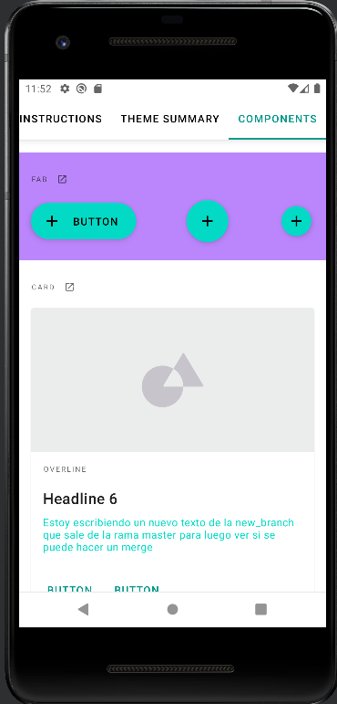
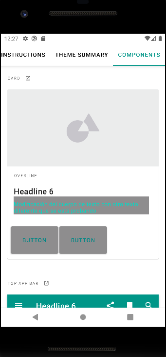

## Creación de ramas
 Rama modificaciones y new_branch que proceden de la rama master
 Rama other que procede de la rama modificaciones

## Modificaciones RAMA MASTER
 * Texto del componente cards [component_cards_master](https://github.com/AlmuFerCar/MaterialThemeBuilder/blob/master/app/src/main/res/layout/component_cards.xml)
 * Color del fondo del componente fabs [component_fabs_master](https://github.com/AlmuFerCar/MaterialThemeBuilder/blob/master/app/src/main/res/layout/component_fabs.xml)

## Modificaciones RAMA MODIFICACIONES
 * creacion y aplicacion estilo botones componente cards: tamaño y color [component_cards_modificaciones](https://github.com/AlmuFerCar/MaterialThemeBuilder/blob/modifications/app/src/main/res/layout/component_cards.xml)
 * estilo de los botones [estilo_botones_cards](https://github.com/AlmuFerCar/MaterialThemeBuilder/blob/modifications/app/src/main/res/values/styles.xml)
 * adicion de colores [nuevos_colores](https://github.com/AlmuFerCar/MaterialThemeBuilder/blob/modifications/app/src/main/res/values/color.xml)

